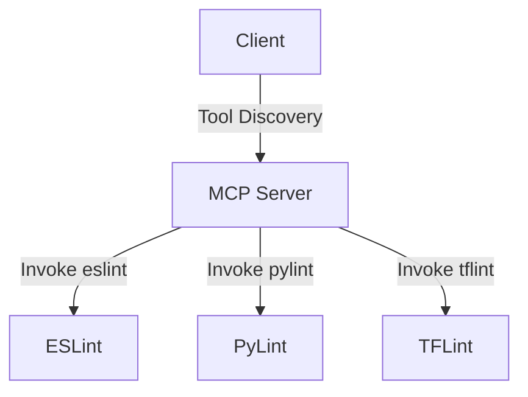
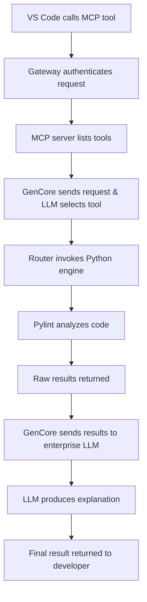

# MCP Python Linter

## Overview
This project demonstrates the use of the Model Context Protocol (MCP) to enable linting capabilities for Python code. The MCP framework allows seamless integration between tools and LLMs, where tools perform the actual work, and LLMs orchestrate and interpret the results.

### Key Features
- **MCP Integration**: Implements a true MCP flow for linting Python code.
- **Tool Discovery and Invocation**: Dynamically lists and invokes tools registered on the MCP server.
- **Linting with OpenAI**: Uses OpenAI's API to analyze code and return structured linting results.

## How It Works

### Workflow
1. **Client Initialization**: The client reads the code to be analyzed and connects to the MCP server.
2. **Tool Discovery**: The client retrieves the list of available tools from the server.
3. **Tool Invocation**: The client invokes the linting tool, passing the code to be analyzed.
4. **Linting Execution**: The server processes the request, runs the linting logic, and returns the results.
5. **Result Interpretation**: The client displays the raw linting results and optionally uses an LLM to interpret them.

### Architecture
```
Client → MCP Server → Lint Engine → OpenAI API
```
- **Client**: Handles user interaction and communicates with the MCP server.
- **MCP Server**: Manages tool registration and invocation.
- **Lint Engine**: Implements the actual linting logic.
- **OpenAI API**: Provides advanced code analysis capabilities.

## Updated MCP-Based Linting Workflow

### Overview
This project demonstrates a real MCP-based linting scenario where the LLM is used for both tool selection and result refinement. The workflow ensures that the MCP server handles the actual linting, while the LLM orchestrates and interprets the results.

### Workflow
1. **Tool Selection**:
   - The client retrieves the list of available tools from the MCP server.
   - The LLM selects the most appropriate tool for the given code.
2. **Linting Execution**:
   - The selected tool is invoked via the MCP server to analyze the code.
   - The MCP server returns raw linting results.
3. **Result Refinement**:
   - The raw linting results are sent to the LLM for detailed analysis and suggestions.

### Example Output
```
======================================================================
MCP-BASED LINTER
======================================================================

Connecting to MCP server...
✓ Connected to MCP server
✓ Available tools: ['pylint', 'eslint', 'tflint']

LLM selected tool: pylint

======================================================================
STEP 2: Executing selected linter tool
======================================================================

✓ Linter tool executed successfully

Raw linting results:
----------------------------------------------------------------------
[{'line': 1, 'message': 'Missing docstring', 'severity': 'warning'}]
----------------------------------------------------------------------

======================================================================
STEP 3: Refining linting results with LLM
======================================================================

✓ LLM refined the linting results

Refined analysis:
- Line 1: Missing docstring. Add a docstring to describe the function's purpose.
```

### Key Benefits
- **Dynamic Tool Selection**: The LLM dynamically selects the most appropriate tool based on the available options.
- **Separation of Concerns**: The MCP server handles linting, while the LLM focuses on orchestration and interpretation.
- **Extensibility**: Easily add new tools to the MCP server without modifying the client logic.

## Usage

### Prerequisites
- Python 3.8+
- Install dependencies:
  ```bash
  pip install -r requirements.txt
  ```
- Ensure the OpenAI API key is set in the `.env` file:
  ```
  OPENAI_API_KEY=your-api-key
  ```

### Running the Linter
1. Start the MCP server:
   ```bash
   python server/mcp_server.py
   ```
2. Run the client:
   ```bash
   python client/mcp_client.py
   ```

### Example Output
```
======================================================================
MCP-BASED LINTER
======================================================================

Connecting to MCP server...
✓ Connected to MCP server
✓ Available tools: ['analyze_python_code']

======================================================================
STEP 2: Executing linter tool directly
======================================================================

✓ Linter tool executed successfully

Raw linting results:
----------------------------------------------------------------------
[{'line': 1, 'message': 'Missing docstring', 'severity': 'warning'}]
----------------------------------------------------------------------
```

## Project Structure
```
.
├── README.md
├── requirements.txt
├── client/
│   ├── mcp_client.py            # Client implementation
├── server/
│   ├── mcp_server.py            # MCP server implementation
│   ├── lint_engine.py           # Linting logic
│   └── rules_config.json        # Configurable linting rules
└── sample-code/
    └── bad_code.py              # Sample code for testing
```

## Key Benefits of MCP
- **Decoupled Architecture**: Tools and LLMs operate independently.
- **Scalability**: Easily extendable with new tools.
- **Flexibility**: Supports various workflows and use cases.

## Next Steps
- Enhance the linting logic with additional rules.
- Integrate more tools into the MCP server.
- Explore advanced use cases with OpenAI's GPT models.

## Enterprise-Grade Approach

In an enterprise-grade implementation, direct access to OpenAI models is typically restricted. Instead, organizations use a secure and standardized wrapper or gateway to interact with AI models. For example, in this project, we are using a personal OpenAI API key for demonstration purposes. However, in a production environment, the following changes would be made:

### Key Differences in Enterprise Implementation
1. **Model Access**:
   - **Current Demo**: Direct access to OpenAI API using an API key.
   - **Enterprise**: Use a wrapper like `GenCore` to interact with AI models securely.

2. **Authentication and Authorization**:
   - **Current Demo**: API key stored in `.env` file.
   - **Enterprise**: Centralized authentication using OAuth, service principals, or API gateways.

3. **Infrastructure**:
   - **Current Demo**: Local MCP server and client communicating over `stdio`.
   - **Enterprise**: Deployed on cloud infrastructure (e.g., Azure, AWS) with scalable services like Kubernetes or serverless functions.

4. **Monitoring and Logging**:
   - **Current Demo**: Basic logging to the console.
   - **Enterprise**: Centralized logging and monitoring using tools like Splunk, Datadog, or Azure Monitor.

### Example: Using GenCore for Model Access
In an enterprise setup, the `lint_engine.py` would be updated to use `GenCore` instead of directly calling OpenAI. Here’s an example:

```python
# Example: Using GenCore Wrapper
from gencore import GenCoreClient

def analyze_code_with_gencore(code):
    client = GenCoreClient()
    response = client.analyze_code(
        model="gpt-4-enterprise",
        code=code
    )
    return response["analysis"]
```

### Benefits of Enterprise-Grade Approach
- **Security**: Ensures sensitive data is protected.
- **Scalability**: Supports large-scale deployments.
- **Compliance**: Meets organizational and regulatory requirements.
- **Monitoring**: Provides detailed insights into system performance and usage.

By adopting these practices, the MCP Python Linter can be scaled and secured for enterprise use cases.

### Supporting Multiple Tools in an Enterprise-Grade Setup

In an enterprise-grade implementation, it is common to support multiple tools for different use cases, such as `eslint` for JavaScript, `pylint` for Python, and `tflint` for Terraform. Below is an approach to handle this scenario effectively:

#### Key Considerations
1. **Single vs Multiple MCP Servers**:
   - **Single MCP Server**:
     - All tools are registered on a single MCP server.
     - Simplifies deployment and management.
     - Suitable for smaller teams or environments with fewer tools.
   - **Multiple MCP Servers**:
     - Each tool or group of tools has its own dedicated MCP server.
     - Provides better isolation and scalability.
     - Suitable for large-scale environments with diverse tools and teams.

2. **Tool Registration**:
   - Each tool should be registered with the MCP server(s) using a unique name and schema.
   - Example:
     ```python
     @app.register_tool("eslint", description="Lint JavaScript code")
     @app.register_tool("pylint", description="Lint Python code")
     @app.register_tool("tflint", description="Lint Terraform code")
     ```

3. **Dynamic Tool Discovery**:
   - The client should dynamically discover available tools from the MCP server.
   - Example:
     ```python
     tools_list = await session.list_tools()
     for tool in tools_list.tools:
         print(f"Tool: {tool.name}, Description: {tool.description}")
     ```

4. **Tool Invocation**:
   - The client should invoke the appropriate tool based on the file type or user input.
   - Example:
     ```python
     if file_type == "python":
         tool_name = "pylint"
     elif file_type == "javascript":
         tool_name = "eslint"
     elif file_type == "terraform":
         tool_name = "tflint"

     result = await session.call_tool(tool_name, {"code": code_to_analyze})
     ```

#### Recommended Approach
- **For Small to Medium Teams**:
  - Use a **single MCP server** to manage all tools.
  - Register all tools on the same server and use dynamic discovery to invoke the appropriate tool.

- **For Large Enterprises**:
  - Use **multiple MCP servers**, each dedicated to a specific domain (e.g., JavaScript, Python, Terraform).
  - Implement a gateway or load balancer to route requests to the appropriate MCP server.

#### Example Architecture


#### Benefits of This Approach
- **Flexibility**: Easily add or remove tools as needed.
- **Scalability**: Scale MCP servers independently based on tool usage.
- **Maintainability**: Centralized or domain-specific management of tools.

By adopting this approach, the MCP Python Linter can be extended to support multiple tools in a scalable and maintainable way.

### Developer Workflow

Below is the flow of how the MCP-based linter integrates into the developer workflow:



-proj-JyIcGzUM8nlF_aS0y5-uprGkGIns1TSg-t9HIw1FpC1uXhVn5ry7GqVkzWoVnR8Cd0EpH25JXVT3BlbkFJRDodAKNjCKTzRUe09X05c4wCYiN5vGUKTxvUiPqEe12ow0lR-eSbRmt_5tQTV4umMu83c4z0gA

This workflow ensures that the developer receives detailed and refined feedback on their code, leveraging the power of MCP, enterprise LLMs, and tools like `pylint`.
